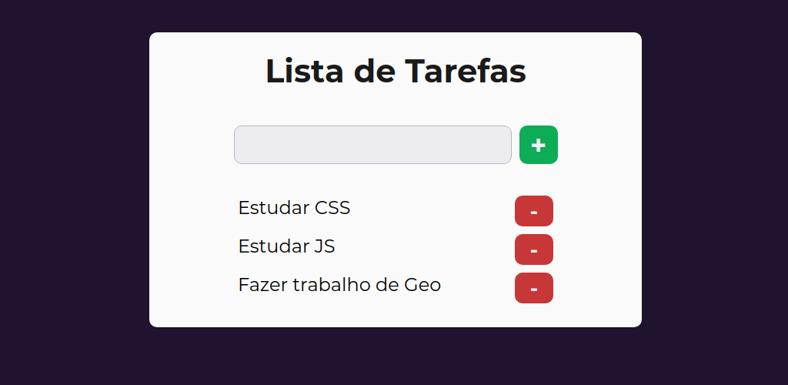

# [Lista de Tarefas](https://heyloh.github.io/todos/index.html)
✔ Projeto simples de uma lista de tarefas utilizando HTML, CSS e JavaScript.

  

#### O que tive que fazer?
- Prática de todo conhecimento de Lógica de Programação
- Manipulação de JSON
- Armazenamento de Dados no LocalStorage
- Manipulação da DOM

Eu disse que era simples 🤷🏽

---
Feito com ❤️ por Lohana Torres.
